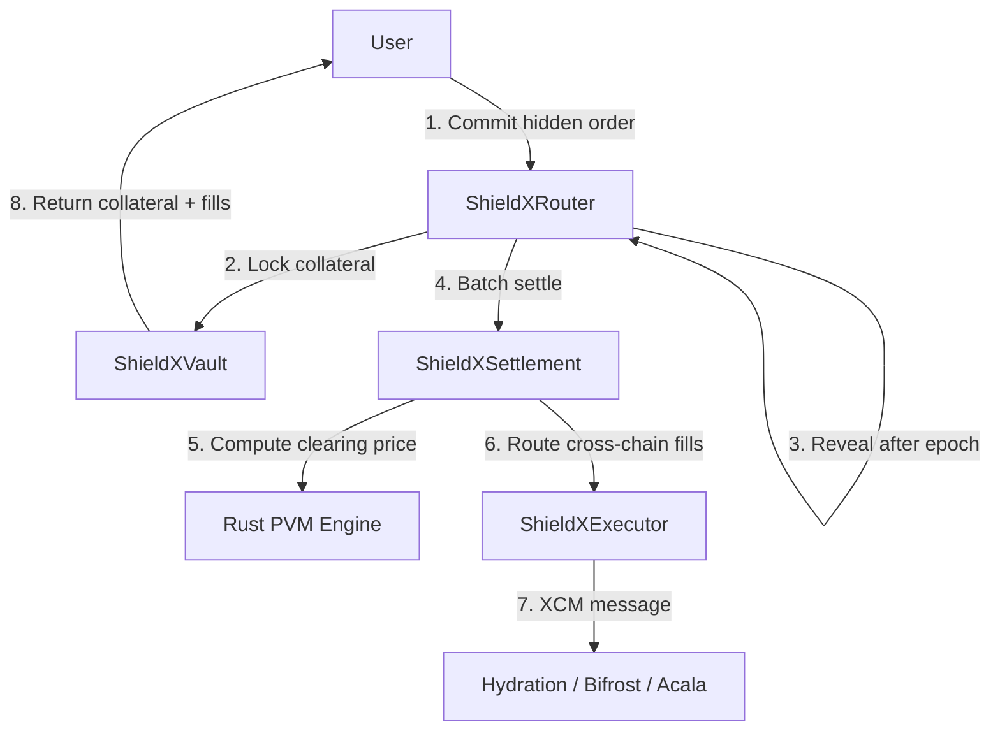

# ShieldX — MEV-Protected Cross-Chain Intent Execution Protocol

> The first MEV protection infrastructure on Polkadot Hub

**Built for the Polkadot Solidity Hackathon 2026 — Track 2: PVM Smart Contracts**

## The Problem

Every DeFi swap on Polkadot Hub is vulnerable to sandwich attacks and front-running. On Ethereum, MEV extracts $500M+ per year from users. As DeFi grows on Polkadot, this problem follows — and there is **zero protection infrastructure** today.

## The Solution

ShieldX is a commit-reveal batch auction protocol that makes MEV extraction impossible:

1. **COMMIT** — Users submit encrypted order commitments with PAS collateral. Order details are invisible on-chain.
2. **REVEAL** — After the epoch window closes, users reveal their orders. Hashes are verified against commitments.
3. **SETTLE** — A Rust PVM contract (running natively on PolkaVM/RISC-V) computes a uniform clearing price via batch auction matching. All orders in a batch execute at the **same price** — no sandwich attacks possible.
4. **EXECUTE** — Matched fills are distributed. Cross-chain fills route via XCM to parachains (Hydration, Bifrost, Acala).

## Architecture



```
contracts/
├── interfaces/          # IShieldXRouter, IShieldXEngine, IXCM
├── core/                # Router, Vault, Settlement, Executor
├── libraries/           # OrderLib, EpochLib
├── mock/                # MockShieldXEngine (Solidity mirror of Rust PVM)
└── precompile/src/      # lib.rs (Rust PVM contract for RISC-V/PolkaVM)

frontend/src/
├── components/          # Dashboard, OrderPanel, EpochTimer, SandwichDemo, BatchVisualizer
├── hooks/               # useWallet, useEpoch, useShieldX
└── utils/               # commitHash, contracts, theme

test/
├── unit/                # 7 test files (Router, Vault, Settlement, Executor, Engine, Surplus, Fees, AccessControl)
├── integration/         # Full flow E2E tests
└── e2e/                 # Playwright browser tests
```

## Why Only Polkadot

This architecture is impossible on any other chain. It requires all four Polkadot primitives simultaneously:

| Primitive | Role in ShieldX |
|-----------|----------------|
| **PolkaVM (PVM)** | Rust PVM contract for batch auction computation in native RISC-V |
| **XCM** | Cross-chain order routing to parachain DEXs without bridges |
| **Shared Security** | Trustless cross-chain settlement via relay chain validators |
| **Dual-VM** | Solidity interface + Rust heavy computation in the same protocol |

## Track 2 Category Coverage

### 1. PVM Experiments — Rust from Solidity
The `ShieldXEngine` Rust PVM contract handles batch auction matching (O(N log N)), manipulation detection (wash trading, spoofing, market impact), and TWAP computation — all compiled to RISC-V for native PolkaVM execution.

### 2. Applications Using Polkadot Native Assets
Users trade native PAS/DOT (not wrapped), vDOT from Bifrost, and Asset Hub stablecoins (USDC, USDT). Collateral bonds paid in native tokens.

### 3. Polkadot Native Functionality — Precompiles
XCM precompile (`0x00000000000000000000000000000000000a0000`) used for cross-chain order routing via `weighMessage()`, `execute()`, and `send()`.

## Tech Stack

| Layer | Technology |
|-------|-----------|
| Smart Contracts | Solidity 0.8.20 (OpenZeppelin AccessControl + Pausable) |
| PVM Contract | Rust (RISC-V, no_std) |
| Cross-Chain | XCM v4 via precompile |
| Testing | Hardhat 2.27+ / Cargo / Playwright |
| Frontend | React 18 + Vite + TailwindCSS + ethers.js v6 |
| Network | Polkadot Hub TestNet (Chain ID: 420420417) |

## How to Run

```bash
# Clone and install
git clone https://github.com/FarseenSh/Shieldx.git
cd Shieldx && npm install

# Run Solidity tests (183 tests)
npx hardhat test

# Run Rust PVM contract tests (38 tests)
cd contracts/precompile && cargo test && cd ../..

# Run sandwich attack demo
npx hardhat run scripts/demo-sandwich.js

# Deploy to Hardhat local node
npx hardhat node                                    # Terminal 1
npx hardhat run scripts/deploy.js --network localhost  # Terminal 2

# Start frontend
cd frontend && npm install && npm run dev           # Terminal 3
# Open http://localhost:5173

# Run Playwright E2E tests (16 tests)
cd frontend && npx playwright test
```

## Test Coverage

| Layer | Framework | Tests |
|-------|-----------|------:|
| Smart Contracts (unit) | Hardhat | 183 |
| Rust PVM Engine | Cargo | 38 |
| Playwright E2E | Playwright | 16 |
| **Total** | | **237** |

**6,600+ lines of code** across Solidity, Rust, JavaScript, and React.

## Key Features

- **Commit-Reveal Batch Auctions** — Orders hidden via cryptographic commitments, settled at uniform clearing price
- **MEV Surplus Tracking** — Users see exactly how much MEV they saved on each trade
- **Protocol Fees** — 0.1% configurable fee (max 1%) demonstrating commercial viability
- **OpenZeppelin AccessControl** — Role-based access (SETTLER_ROLE, PAUSER_ROLE, ROUTER_ROLE)
- **Emergency Pausable** — Circuit breaker pauses commits/reveals while allowing settlement
- **Manipulation Detection** — Wash trading, spoofing, and market impact detection
- **XCM Cross-Chain** — Order routing to Hydration, Bifrost, Acala via XCM precompile
- **Dark/Light Theme** — Production-quality UI with theme toggle

## Prior Art & Differentiation

| Protocol | Chain | Approach | Limitation |
|----------|-------|----------|------------|
| **CoW Protocol** | Ethereum | Batch auctions | Ethereum-only, relies on solvers |
| **No Sandwich Swap** | Polkadot (3rd place, 2024 Hackathon) | Delayed execution | No batch pricing, no cross-chain |
| **Flashbots** | Ethereum | Private mempools | Centralized, trust assumptions |
| **ShieldX** | **Polkadot Hub** | **Commit-reveal batch auction + XCM** | **First cross-chain MEV protection** |

ShieldX is the first protocol to combine commit-reveal cryptography with batch auction pricing AND cross-chain execution via XCM — a combination only possible on Polkadot Hub's dual-VM architecture.

The [Polkadot Forum discussion on encrypted mempools](https://forum.polkadot.network/t/encrypted-mempools-turning-polkadots-mev-leak-into-treasury-revenue/15817) validates the community demand for MEV protection. ShieldX is a concrete smart contract implementation of this vision.

## License

MIT

---

*ShieldX — Build Once. Shield Everywhere.*
